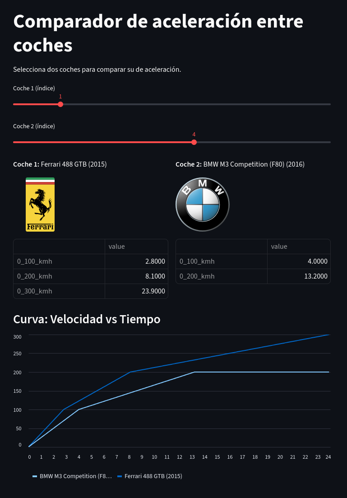

### Este es un pequeño proyecto para demostrar habilidades puntuales con ejercicios o ciertas tecnologías como SQL y Streamlit.




## Requisitos
- Python 3.8+
- Librerías en `requirements.txt` (se utilizó pip freeze > requirements.txt)

## Instalación
Clona este repositorio y ejecuta:

```bash
pip install -r requirements.txt "(instala las dependencias necesarias)"
pip list  "(para ver si se instalaron correctamente)"
```

## 👨‍💻 Author

    Emiliano Perez Paponi
    Full Stack Developer
    GitHub: @Emiliano-Blackbird
    Mail: EmilianoPerezPaponi@gmail.com
